## Git Kolaborasi (Kontributor)
Login ke github kemudian cari repositori yang akan di-*fork*. Dalam contoh ini adalah repository: https://github.com/batmandvs/Playground

## Fork dan Konfigurasi Remote
Klik pada tombol *Fork*.


Beri nama untuk repositori yang akan diubah, atau biarkan sama dengan repositori aslinya. Tambahkan deskripsi jika perlu, kemudian klik *__Create fork__*.
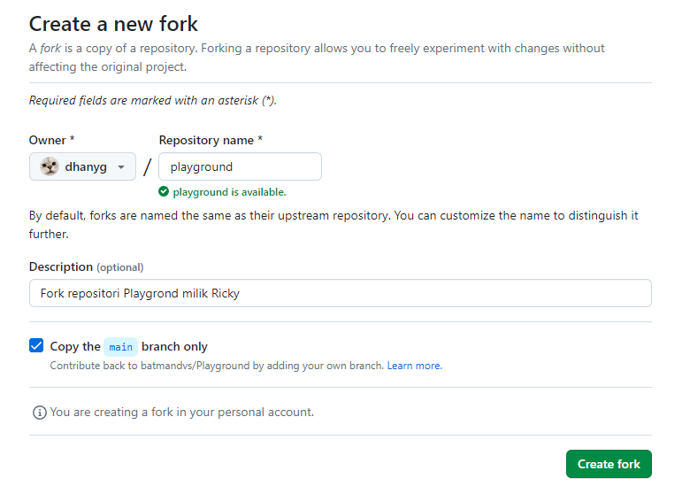

Lakukan *clone* ke lokal komputer dengan perintah:
```
$ git clone https://github.com/dhanyg/playground.git
```
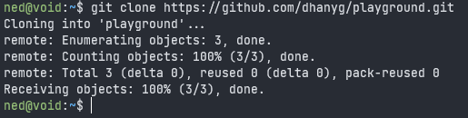
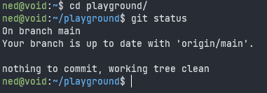

Tambahkan *remote* untuk *upstream* dengan perintah `git remote add <url_repo_asli>`. Kemudian cek daftar *remote* dengan perintah `git remote -v`.
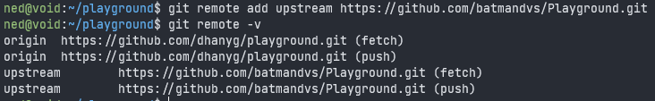

## Mengirimkan Pull Request
Pertama-tama lakukan sinkronisasi dengan repositori asli dengan perintah `git fetch upstream`.
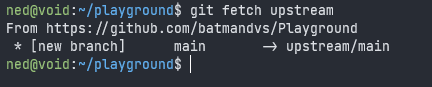

Buat branch baru dengan nama `add-contributor`.
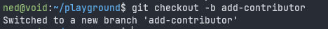

Lakukan pengeditan.
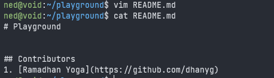

Kemudian lakukan *commit*.
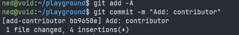

Lakukan *push* ke repositori milik kita.
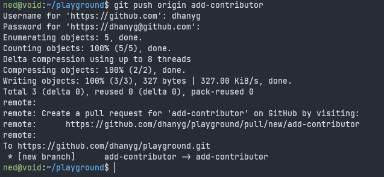

Selanjutnya masuk ke repositori milik kita di github dan pilih *Compare & pull request*.
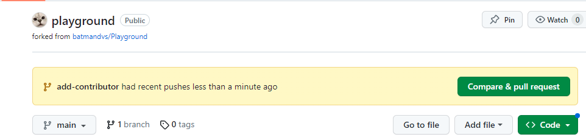

Pastikan *branch* asal dan tujuannya sudah sesuai. Berikan keterangan dan jika sudah selesai, klik *Create pull request*
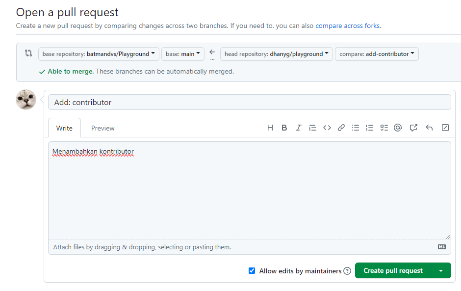

Sampai tahap ini proses membuat *Pull Request* telah selesai. Selanjutnya adalah menunggu *author* untuk memeriksa dan memutuskan akan melakukan *merge* atau *close* terhadap *pull request* yang telah dikirim.

Apabila pemilik menerima dan melakukan *merge* maka status dari *pull request* akan menjadi seperti berikut:
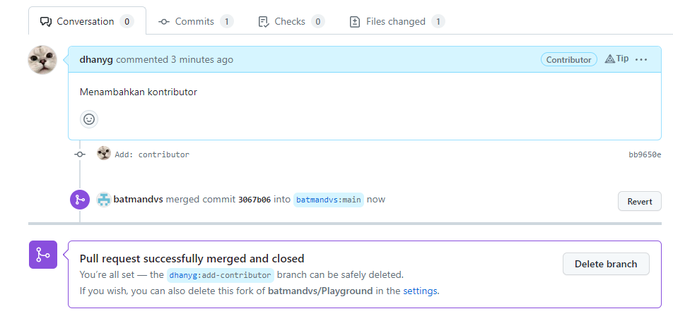

Selesai.