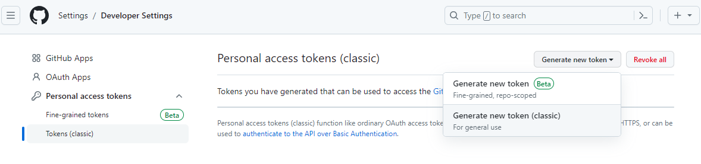
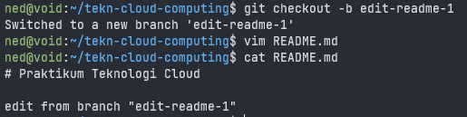

## Instalasi Git
Berikut cara menginstal git pada sistem operasi berbasis linux Ubuntu:
```
$ sudo apt install git -y
```


Setelah proses instalasi selesai, cek dengan perintah `git --version`:


## Konfigurasi Git
Pertama, konfigurasi nama user Git:
```
$ git config --global user.name "Ramadhan Yoga"
```
Kedua, konfigurasi email user Git:
```
$ git config --global user.email "ramayoga04@gmail.com"
```


Kemudian cek konfigurasi dengan perintah `git config --list`:


## Mengelola Repo
### 1. Membuat Repo
Login ke [Github](https://www.github.com) kemudian buat repositori baru dengan mengeklik tanda `+` di bagian atas kemudian pilih *New repository*.


Isi *__Repository Name__* dengan nama `tekn-cloud-computing` dan berikan deskripsi pada bagian *__Description__* (opsional), lalu klik tombol *__Create repository__*.


### 2. Clone Repo
Salin repositori yang telah dibuat di Github tadi ke lokal komputer dengan perintah:
```
$ git clone https://github.com/<username>/<nama_repositori>
```


Jika proses *cloning* berhasil, maka akan muncul sebuah direktori baru dengan nama yang sama seperti nama repositori pada github.


### 3. Mengubah Isi - Push Tanpa Branching dan Merging
Buat sebuah file dengan nama README.md.
```
vim README.md
```


Cek status *Branch* dengan perintah `git status`.


Tambahkan file yang sudah dibuat tadi ke dalam repo git menggunakan perintah `git add -A`


Lakukan *Commit* dengan perintah `git commit -m "Add: README.md"`.


Kemudian lakukan *Push* ke repositori github dengan perintah `git push origin main`.


Apabila terjadi error seperti pada gambar di atas, maka lakukan setup *Personal Access Token* terlebih dahulu sebelum melakukan *push*.

Login ke [Github](https://github.com) kemudian klik icon profile, kemudian Pilih `Settings > Developer Settings > Personal access tokens > Token (classic)`. Lalu klik *__Generate new token__*.


Konfirmasi dengan memasukkan password akun github.

Isi pada bagian *__Note__*. Set *__Expiration__* menjadi `No expiration`, dan berikan centang pada opsi `repo` dan `workflow`. Klik *__Generate token__*.


Silakan salin token yang sudah dibuat tadi. Kemudian lakukan push kembali. Pada bagian password, masukkan token yang sudah di-*copy* tadi.


### 4. Mengubah Isi dengan Branching dan Merging
Buat branch baru dengan nama `edit-readme-1`.
```
$ git checkout -b edit-readme-1
```

Kemudian edit file README.md.


Lakukan *commit* lagi ke repo git.


Lakukan *push* ke repositori github dari branch `edit-readme-1`.
```
$ git push origin edit-readme-1
```


Selanjutnya, lakukan *Pull Request* di Github.


Setelah itu lakukan *merge*.


Terakhir, lakukan *merge* pada branch lokal.
```
$ git checkout main
$ git merge edit-readme-1
```


### 5. Sinkronisasi
Untuk melakukan sinkronisasi antara repositori di github dengan repo lokal di komputer, gunakan perintah `git pull`.


### 6. Membatalkan Perubahan
Buat branch baru dengan nama `edit-readme-2`.
```
$ git checkout -b edit-readme-2
```


Lakukan modifikasi pada file README.md.


Kembali ke branch `main` dan cek isi file README.md


Hapus branch `edit-readme-2` dengan perintah `git branch -D edit-readme-2`. Kemudian cek daftar branch yang masih ada dengan perintah `git branch`.


Untuk mengembalikan isi file README.md ke *state* awal sebelum diubah dari branch `edit-readme-2`, lakukan reset dengan perintah `git reset --hard`.


### 7. Undo Commit Terakhir
Lakukan beberapa kali *commit* dan *push* ke repositori github.


Kembalikan *state* ke posisi sebelum *commit* terakhir dengan menggunakan perintah `git revert HEAD`.


Apabila ingin mengembalikan perubahan yang sudah di-*commit* namun belum dilakukan *push* ke github, gunakan perintah `git reset --hard HEAD^`.


Untuk mengembalikan *state* ke perubahan yang sudah lama, gunakan perintah `git revert <posisi>`.


Edit kembali file README.md untuk memperbaiki error *conflict*. Setelah itu lanjut proses *revert* dengan perintah `git revert --continue`.


Selesai.