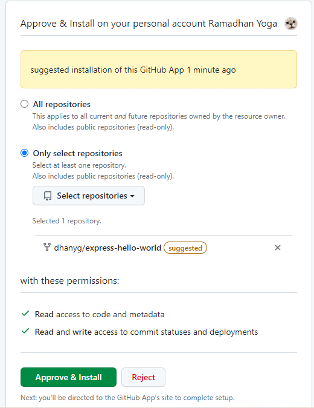
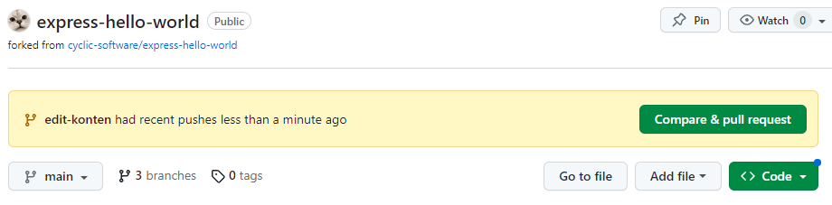

# Deploy Some Code! - Quick Start
## Deploy to Cyclic 
1. Klik tombol *[deploy to cyclic](https://app.cyclic.sh/api/app/deploy/cyclic-software/express-hello-world)* seperti pada gambar di bawah.   
  
  
2. Klik tombol *Continue with Github*.  
  
  
3. Klik tombol *Connect Cyclic*.  
  
  
4. Masukkan password untuk login github.  
  
  
5. Pilih repository yang akan di-*deploy*. Kemudian klik *Approve and Install*.   
  
  
6. Proses instalasi dan *deploy* akan berlangsung.  
  
  
7. Setelah proses *deploy* berhasil, akan muncul alamat situs yang bisa diakses.  
  
  
8. Kunjungi alamat situs yang sudah diberikan tadi.  
  
  
## Mengupdate Repositori
1. *Clone* repositori yang sudah dibuatkan pada saat menjalankan *quick start* tadi.  
```
git clone https://github.com/dhanyg/express-hello-world.git
```
  
2. Lakukan pengeditan pada *source code*.  
  
  
3. Lakukan *commit* kemudian dilanjutkan dengan *push* ke github.  
  
  
  
4. Lakukan *compare & pull request* di Github.  
  
  
5. Pastikan pada bagian *base* dan *compare* sudah sesuai. Kemudian klik tombol *Create pull request*.  
  
  
6. Selanjutnya lakukan *merge pull request* dan *confirm merge*.  
  
  
  
7. Setelah repositori terupdate, kemudian cek pada *dashboard* *Cyclic* yakni pada bagian *Deployment History* maka akan muncul aktivitas *log* yang telah dilakukan di Github sebelumnya.  
  
  
8. Akses kembali alamat web dan sekarang tampilan halaman web telah terupdate.  
  
  
Selesai.