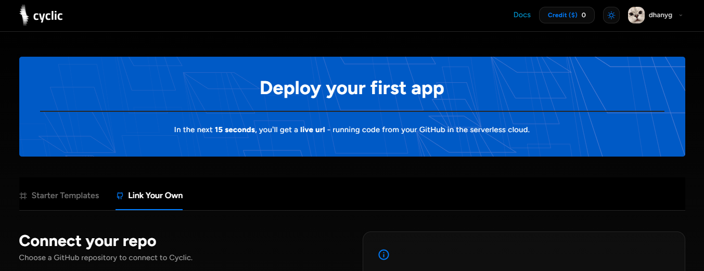
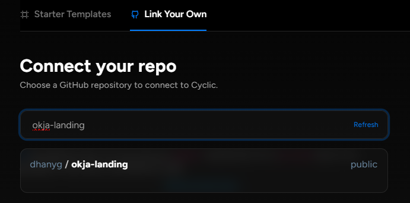
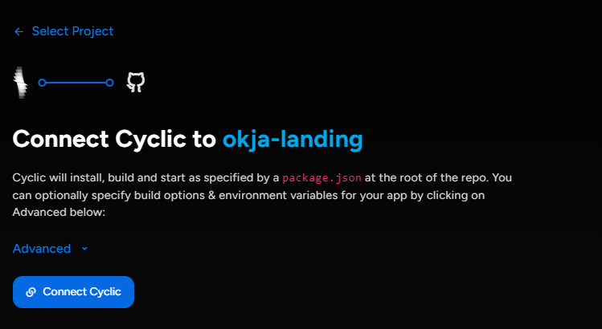
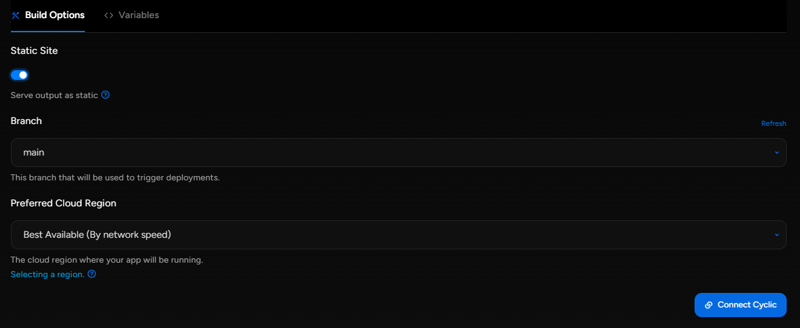
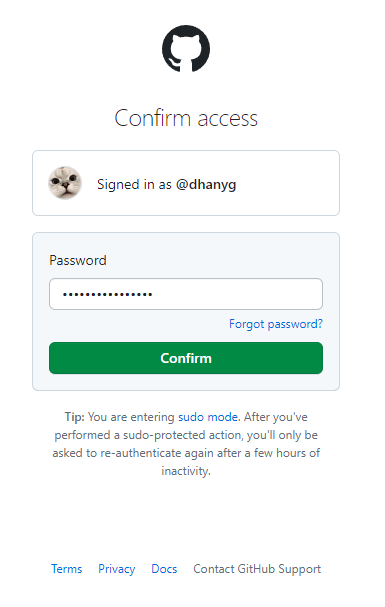
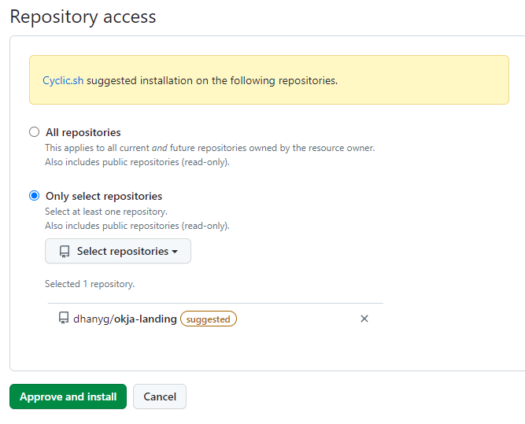
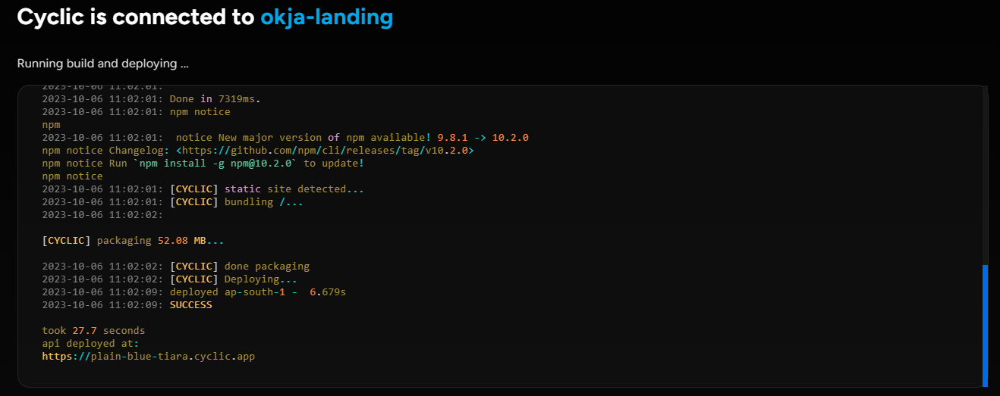

# Deploy Some Code - DIY
Berikut adalah langkah-langkah *deploy* repositori yang ada di Github menggunakan *Cyclic*:  
1. Login atau *Sign-up* menggunakan akun Github ke https://app.cyclic.sh/api/login.  
2. Pada dashboard *Cyclic*, klik pada bagian *Link Your Own*.  
  
3. Ketikkan nama repositori yang akan di-*deploy* kemudian pilih nama respositori tersebut.  
  
4. Proses selanjutnya adalah menghubungkan *Cyclic* dengan repositori yang telah dipilih. Pada bagian ini pilih opsi *Advanced*.  
  
5. Kemudian masuk ke bagian *Build Options*, lalu aktifkan konfigurasi *Static Site*. Konfigurasi ini digunakan apabila di dalam repositori kita hanya terdapat file statik seperti `index.html` atau file-file html lainnya. Jika sudah, klik tombol *Connect Cyclic*.  
  
6. Masukkan password login Github.  
  
7. Pilih repositori, kemudian klik tombol *Approve and Install*.  
  
8. Proses *deploy* akan berlangsung. Setelah selesai akan muncul alamat situs yang bisa diakses.  
  
9. Kunjungi halaman web dengan mengeklik tautan yang telah diberikan.  
  
  
Selesai.