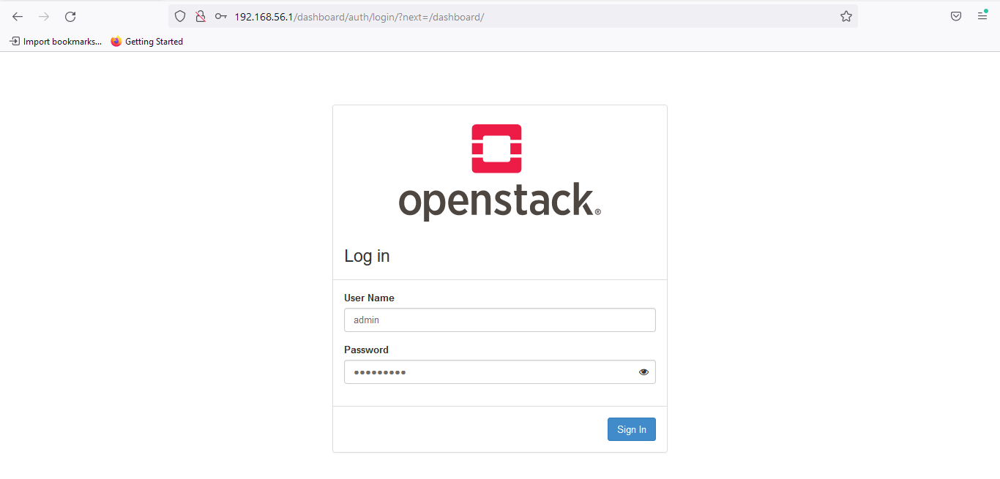
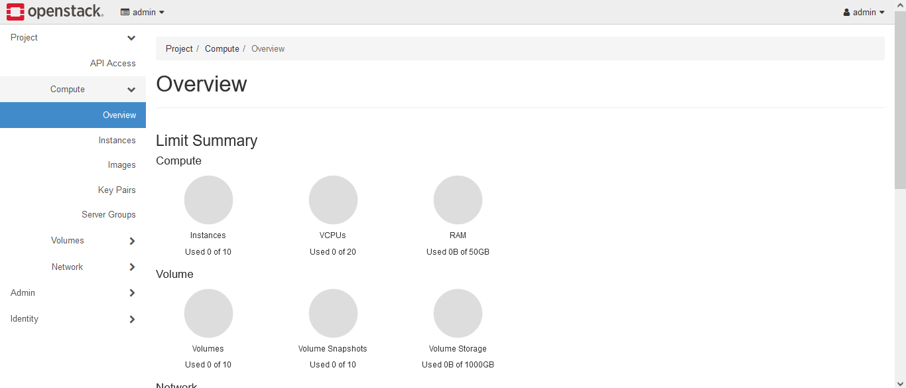
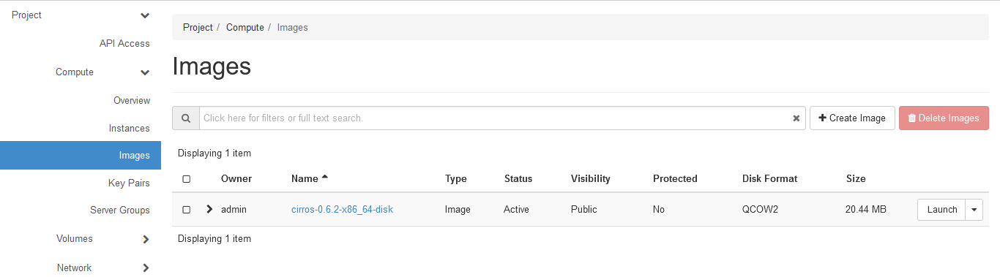
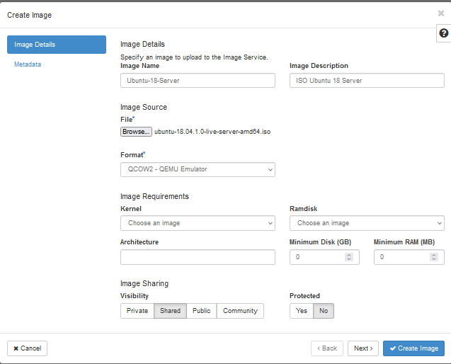
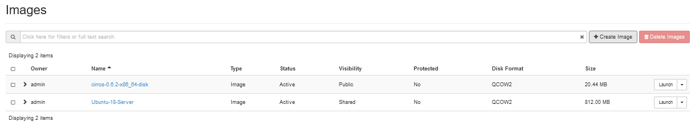

# Menginstal Devstack Pada Ubuntu 22.04

Pada latihan kali ini, mahasiswa diberikan latihan untuk menginstal *Devstack* pada sistem operasi Ubuntu. Sebenarnya instruksi yang diberikan adalah menggunakan sistem operasi Ubuntu 18.04. Akan tetapi karena ada permasalahan kompatibilitas dengan *script* instalasi *Devstack* yang terbaru, maka pada latihan ini digunakan sistem operasi Ubuntu yang terbaru yakni Ubuntu 22.04.  
  
## Pengantar
*Devstack* merupakan kumpulan *extensible script* yang digunakan untuk membangun *environment OpenStack*. *OpenStack* sendiri merupakan aplikasi infrastruktur *cloud computing* yang bersifat *open source*.  

## Langkah-langkah Instalasi Devstack
Pastikan sistem operasi Ubuntu 22.04 sudah terinstal. Bisa dengan melakukan instalasi secara manual atau mengunduh *image* virtual yang bisa dijalankan pada Virtualbox.

Lakukan update sistem dengan perintah:
```
sudo apt update && sudo apt upgrade -y
```

Selanjutnya buat user baru dengan nama `stack`.  
```
sudo useradd -s /bin/bash -d /opt/stack -m stack
```
- opsi -s digunakan untuk mendefinisikan shell yang akan digunakan oleh user
- opsi -d digunakan untuk mendefinisikan *home directory* yang akan digunakan oleh user
- opsi -m digunakan untuk perintah agar *home directory* dibuat

Kemudian tambahkan hak akses *execute* pada direktori `/opt/stack`.  
```
sudo chmod +x /opt/stack
```

Aktifkan *sudo privileges* untuk user `stack` tanpa menggunakan password.  
```
echo "stack ALL=(ALL) NOPASSWD: ALL" | sudo tee /etc/sudoers.d/stack
```

Kemudian login menggunakan user `stack`.  
```
sudo -u stack -i
```

Install *git* dan *pip* dengan perintah:  
```
sudo apt install git python3-pip -y
```

Selanjutnya adalah melakukan *cloning* repositori *devstack*.  
```
git clone https://opendev.org/openstack/devstack
```

Masuk ke dalam direktori *devstack* lalu buat file konfigurasi dengan nama `local.conf`.  
```
cd devstack  
nano local.conf
```

Tambahkan konfigurasi berikut:  
```
ADMIN_PASSWORD=silakan_diisi_dengan_password
DATABASE_PASSWORD=$ADMIN_PASSWORD
RABBIT_DATABASE=$ADMIN_PASSWORD
SERVICE_PASSWORD=$ADMIN_PASSWORD
HOST_IP=ip_address_ubuntu
FORCE=yes
```
- sesuaikan konfigurasi pada bagian `ADMIN_PASSWORD` dan `HOST_IP`
  
Lakukan instalasi *Devstack* dengan menjalankan perintah:
```
./stack.sh
```

Silakan tunggu proses intalasi hingga selesai. Proses instalasi memakan waktu yang lama tergantung kecepatan komputer dan koneksi internet.  
  
Setelah proses instal selesai, lakukan pengecekan dengan mengakses ke url `http://ip-address/dashboard`.  
  
  
Login ke dalam *OpenStack* menggunakan user `admin` serta password yang digunakan pada saat konfigurasi file `local.conf` tadi.  
  

## Menambahkan Image Pada OpenStack
Untuk menambahkan *image*, masuk ke menu *__images__* kemudian pilih *__Create image__*.  
  

Isi pada bagian *__Image Name__*, *__Image Descriptionn__*. Upload *image* pada bagia *__Browse__* lalu pilih format *__QCOW2 - QEMU Emulator__*.  

  
Proses upload akan berlangsung. Setelah selesai maka *image* tadi akan muncul pada halaman *__Images__*.  
  
  
Selesai.