# Mininet Walkthrough
Pada tugas ini, mahasiswa melakukan demonstrasi penggunaan perintah *Mininet* serta penggunaan *Mininet* pada umumnya.  
  
## Menginstal Mininet
Unduh file *image* Mininet melalui tautan [ini](https://github.com/mininet/mininet/releases/), kemudian unduh file dengan nama `mininet-2.3.0-210211-ubuntu-20.04.1-legacy-server-amd64-of.zip`.  
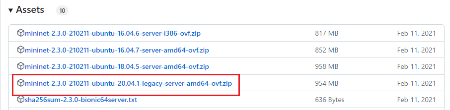  
  
*Extract* file yang sudah diunduh, kemudian jalankan file `mininet-2.3.0-210211-ubuntu-20.04.1-legacy-server-amd64.ovf`. *__*pastikan sudah terinstal Virtualbox di komputer.__*  
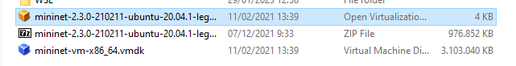  
  
Lakukan *import* pada Virtualbox.  
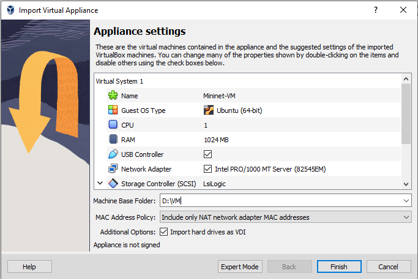  
  
Selanjutnya konfigurasi *network* dan tambahkan adapter *Host-only*.  
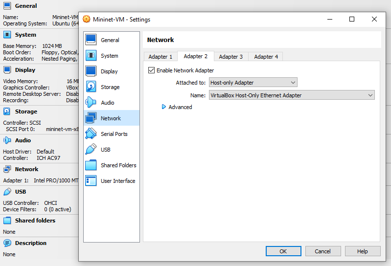  
  
Jalankan *VM* Mininet. Kemudian login menggunakan kredensial:  
user: mininet  
password: mininet  
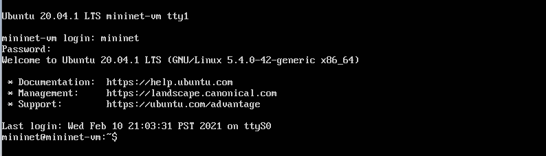  
  
Konfigurasi *ip address* untuk adapter *Host-only* dengan perintah `sudo dhclient <nama_interface>`.  
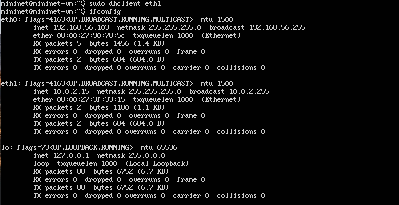  
  
Selesai.

## Demonstrasi Mininet
### Berinteraksi dengan Host dan Switch
Untuk masuk ke *command line* Mininet, gunakan perintah `sudo mn`. Maka akan dibuatkan topologi sederhana berupa satu buah switch (s1) dan dua buah komputer (h1) dan (h2).  
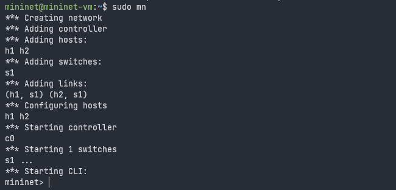  
  
Untuk menampilkan *nodes*, ketikkan perintah `nodes`.  
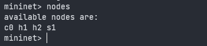  
  
Untuk menampilkan *links*, ketikkan perintah `net`.  
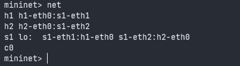  
  
Untuk menampilkan informasi *dump* dari setiap *node*, ketikkan perintah `dump`.  
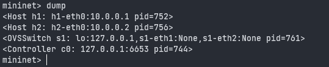  
  
Untuk melihat konfigurasi ip address (h1), ketikkan perintah `h1 ifconfig -a`.  
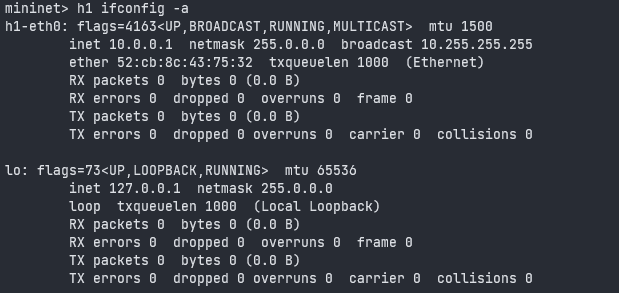  
  
Untuk melihat konfigurasi ip address pada switch (s1), ketikkan perintah `s1 ifconfig -a`.  
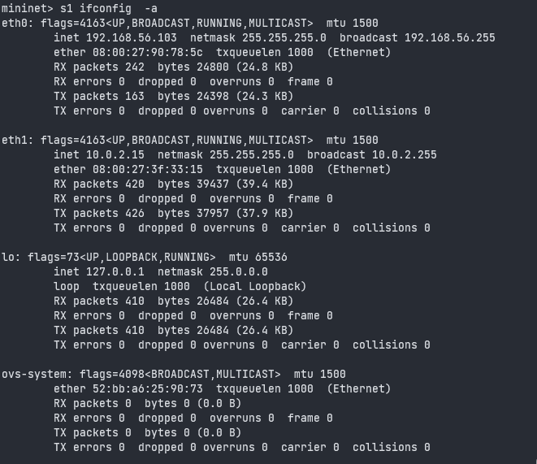  
  
### Tes Konektivitas Antar Host
Untuk melakukan ping dari (h1) ke (h2), ketikkan perintah `h1 ping -c 1 h2`.  
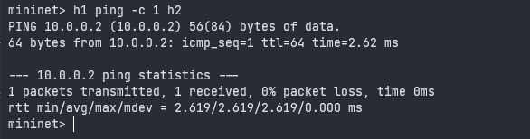  
  
Kita juga bisa menggunakan perintah `pingall` untuk melakukan tes konektivitas seluruh node dalam jaringan.  
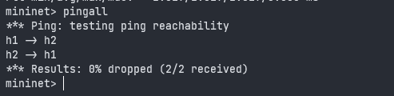  
  
### Menjalankan Regression Test
Kita bisa langsung mengakses perintah-perintah Mininet tanpa harus masuk ke *console* Mininet. Berikut adalah perintah untuk menjalankan *regression test* langsung dari terminal:  
```
sudo mn --test pingpair
```
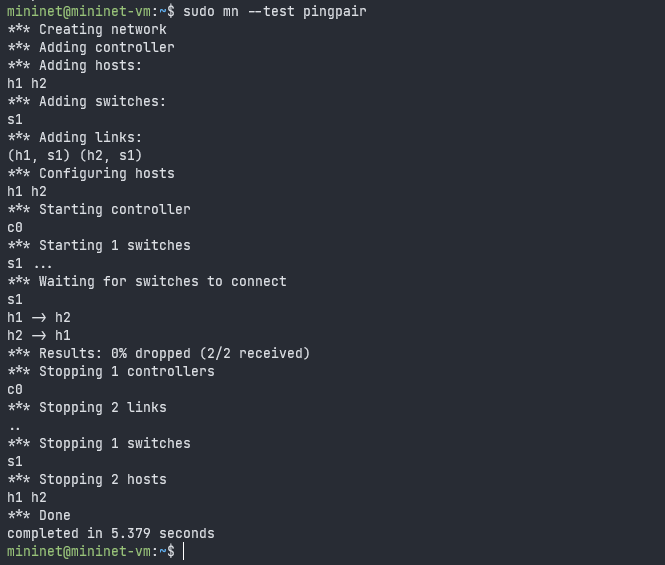  
  
Perintah lain yang bisa digunakan adalah `sudo mn --test iperf`.  
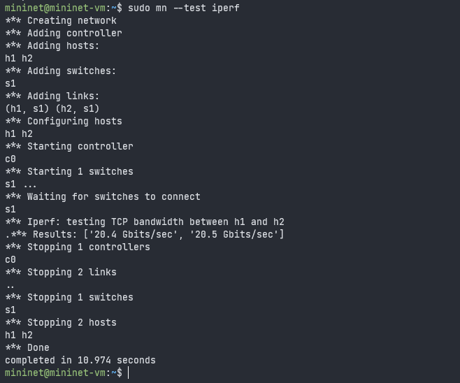  
  
### Mengubah Tipe Topologi
Topologi default yang dijalankan di dalam Mininet adalah *single* yakni sebuah switch yang terhubung ke dua buah host. Misalkan kita ingin melakukan *regression test* dengan tiga buah host maka perintah yang digunakan adalah:  
```
sudo mn --test pingall --topo single,3
```
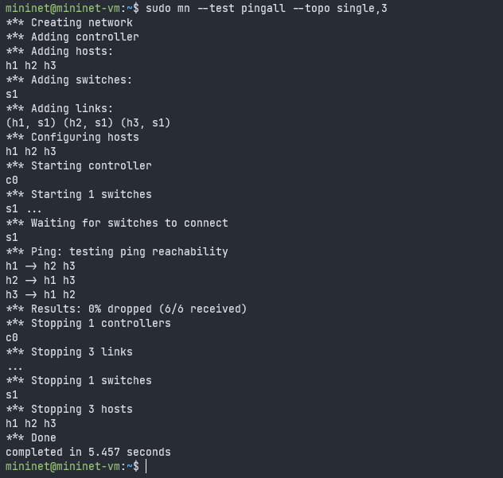  
  
Contoh lainnya adalah melakukan *regression test* menggunakan topologi *linear*.  
```
sudo mn --test pingall --topo linear,4
```
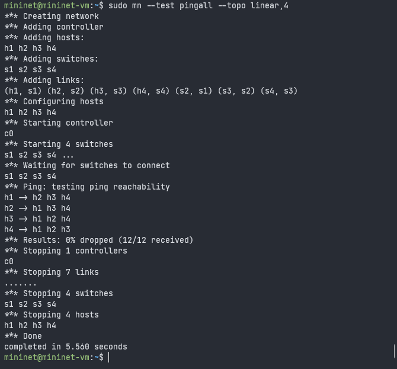  
  
Kita juga bisa merancang topologi kita sendiri. Berikut contoh *script* untuk membuat sebuah topologi kustom:  
```
"""Custom topology example

Two directly connected switches plus a host for each switch:

   host --- switch --- switch --- host

Adding the 'topos' dict with a key/value pair to generate our newly defined
topology enables one to pass in '--topo=mytopo' from the command line.
"""

from mininet.topo import Topo

class MyTopo( Topo ):
    "Simple topology example."

    def build( self ):
        "Create custom topo."

        # Add hosts and switches
        leftHost = self.addHost( 'h1' )
        rightHost = self.addHost( 'h2' )
        leftSwitch = self.addSwitch( 's3' )
        rightSwitch = self.addSwitch( 's4' )

        # Add links
        self.addLink( leftHost, leftSwitch )
        self.addLink( leftSwitch, rightSwitch )
        self.addLink( rightSwitch, rightHost )


topos = { 'mytopo': ( lambda: MyTopo() ) }
```
Simpan file di atas ke dalam direktori `~/mininet/custom`. Kemudian jalankan topologi dengan perintah:  
```
sudo mn --custom ~/mininet/custom/[nama-file.py] --topo [nama-topologi] --test pingall
```
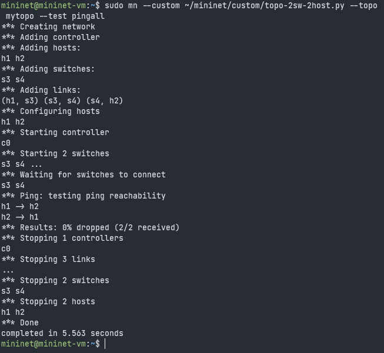  
  
### Python Intrepeter
Kita bisa menjalankan perintah-perintah yang berbentuk file *Python* (.py). Berikut beberapa contohnya:  
```
py locals()
```
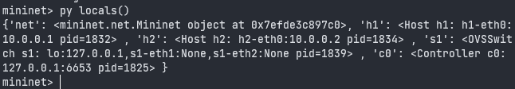  
  
```
py dir(s1)
```
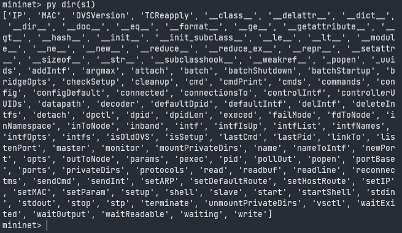  
  
```
py h1.IP()
```
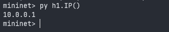  
  
Selesai.