# Panduan Berberlanja di Ofbiz E-Commerce
## Registrasi Member
Akses ecommerce melalui halaman https://localhost:8443/ecommerce.  
  
Kemudian pilih menu *Register*.  
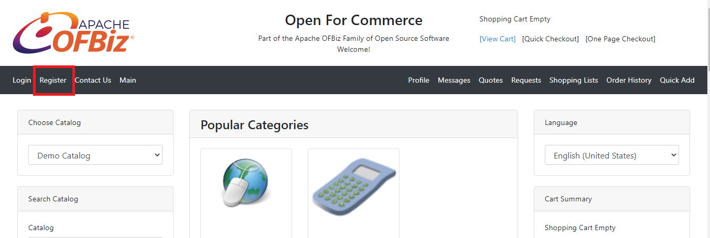  
  
Lakukan pengisian data diri.  
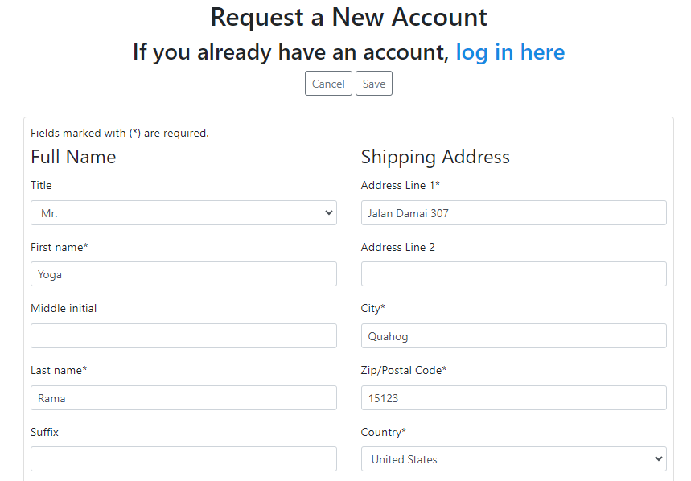  
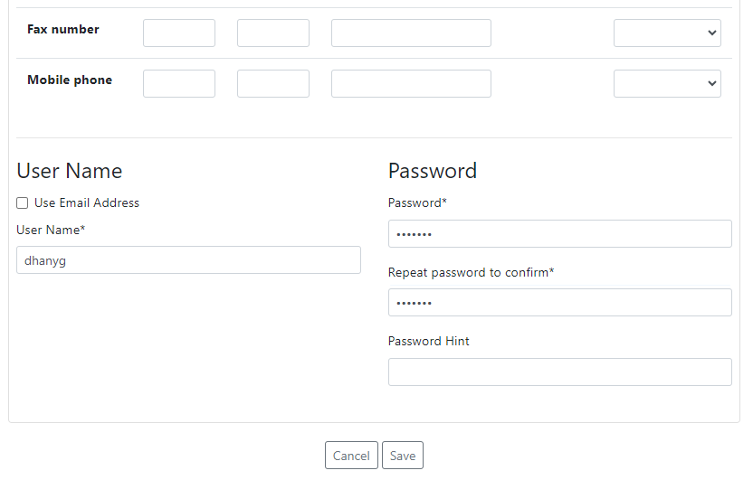  
Klik *Save* untuk memproses registrasi.  
  
Jika berhasil, Anda akan dialihkan ke halaman beranda E-Commerce.  
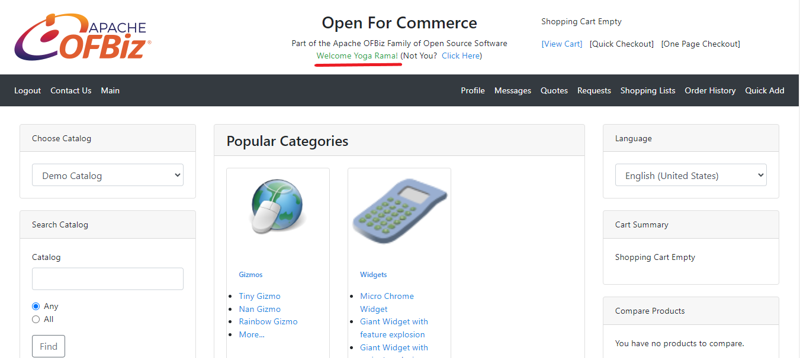  
  
## Login E-Commerce
Apabila Anda sebelumnya sudah mendaftar dan memiliki akun, maka Anda dapat langsung login ke dalam E-Commerce dengan memilih menu *Login*.  
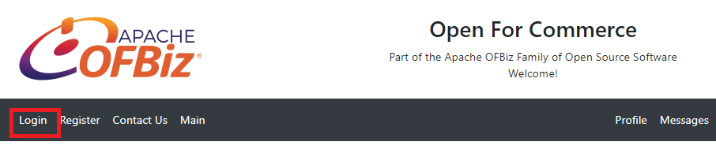  
  
Kemudian login menggunakan username dan password Anda.  
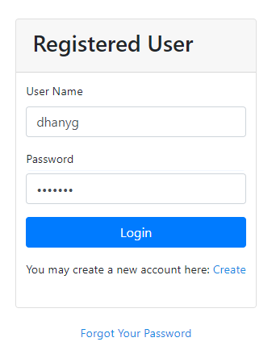  
  
Apabila berhasil, Anda akan diarahkan kembali ke halaman beranda E-Commerce.  
  
  
## Menambahkan Barang ke Keranjang
Cari barang yang ingin Anda beli. Anda dapat melakukan pencarian melalui *__Search Catalog__* atau mencari produk melalui bagian *__Categories__*.  
Misalkan Anda ingin membeli sebuah *Gizmos*. Maka pada bagian *__Categories__*, klik pilihan *Gizmos*, kemudian klik pilihan *Small Gizmos*.  
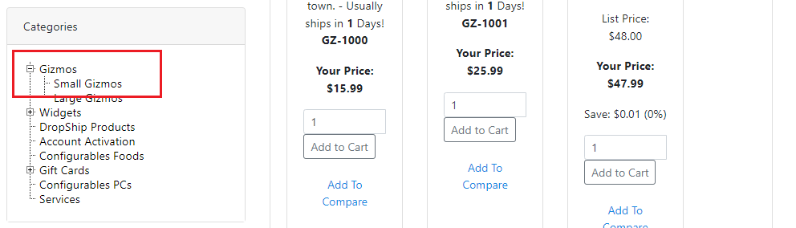  

Akan ditampilkan daftar produk pada kategori tersebut. Misalkan Anda ingin membeli produk *Tiny Gizmo*. Maka klik tombol *__Add to Cart__* yang ada di bawahnya.  
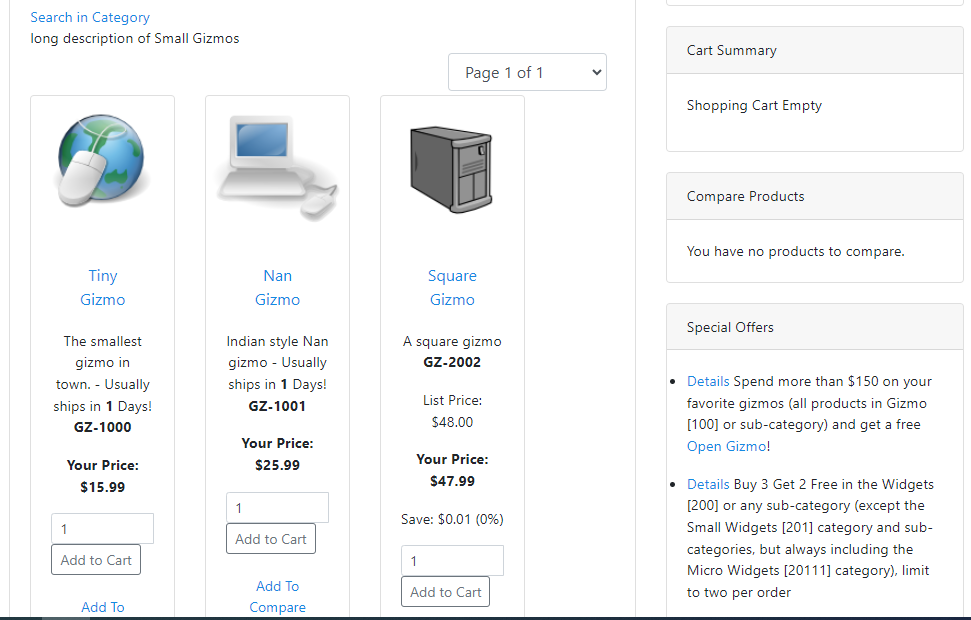  
  
Maka barang yang telah dipilih tadi akan masuk ke bagian *__Cart Summary__*.  
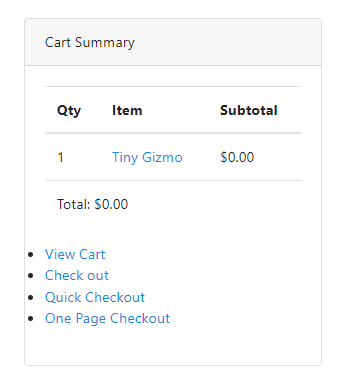  

## Melakukan Checkout Barang
Klik pilihan *View Cart* pada bagian *__Cart Summary__*.  
  
  
Pilih item yang akan di-*checkout* lalu klik tombol *__Checkout__*  
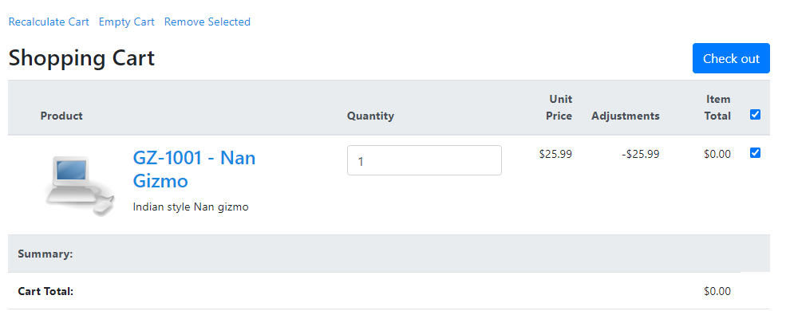  
  
Pilih alamat yang akan digunakan sebagai tujuan pengiriman. Kemudian klik *__Next__*.  
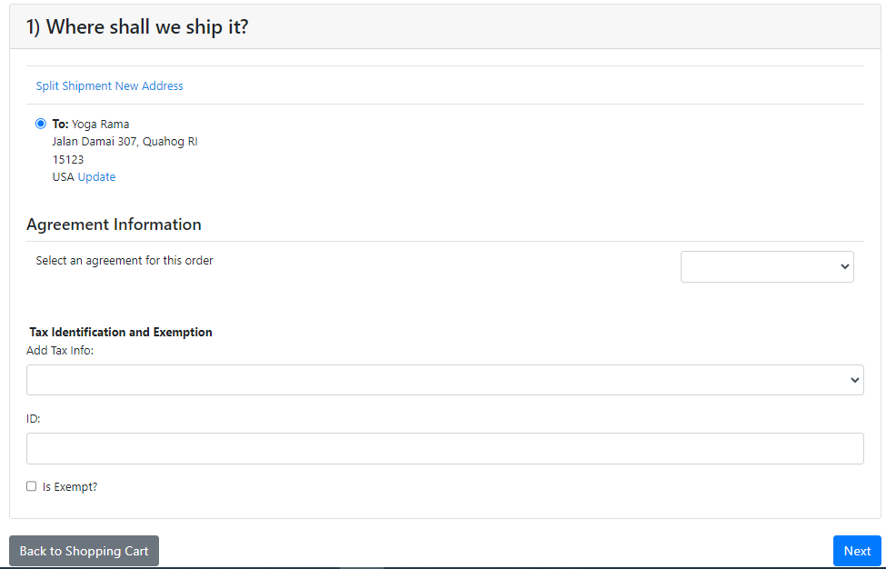  
  
Tambahkan pesan atau instruksi tambahan pada bagian *__Special Instructions__* apabila perlu.  
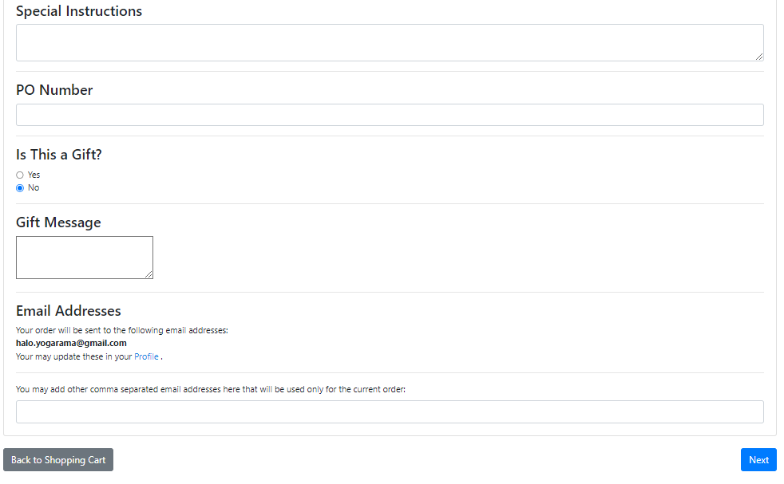  
Kemudian klik *__Next__*.  
  
Selanjutnya pilih metode pembayaran yang akan Anda gunakan. Kemudian klik tombol *__Continue to Final Order Review__*.  
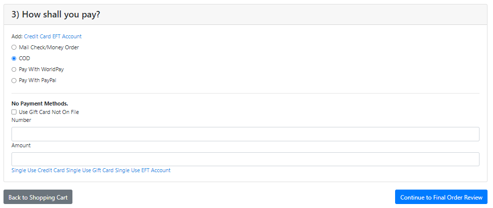  
  
Review kembali barang yang ingin Anda checkout, apabila sudah yakin silakan klik tombol *__Submit Order__*.  
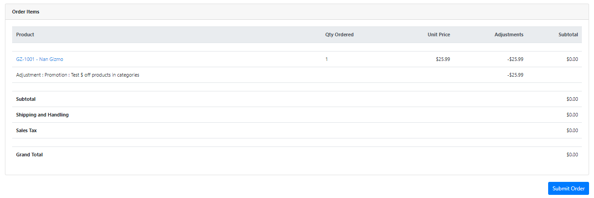  
  
Proses checkout telah selesai dan Anda akan mendapatkan informasi *Order Confirmation*.  
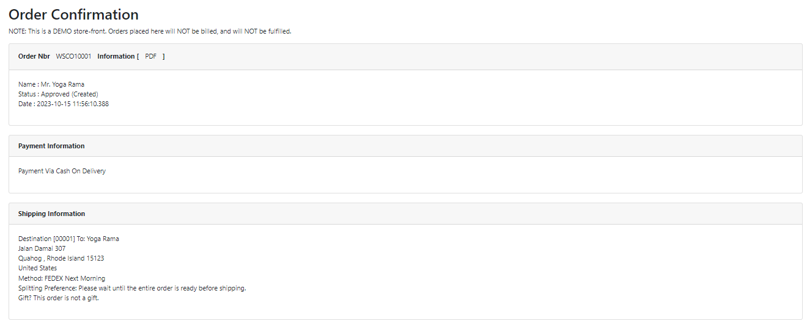  
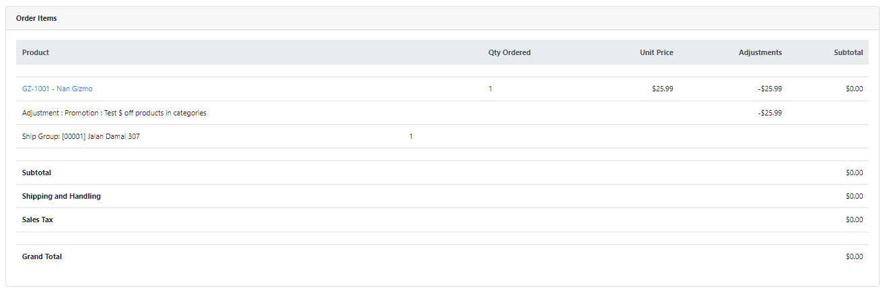  
  
Selesai.