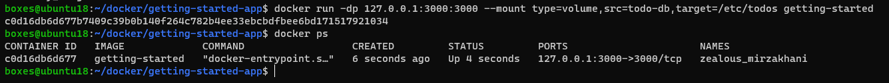
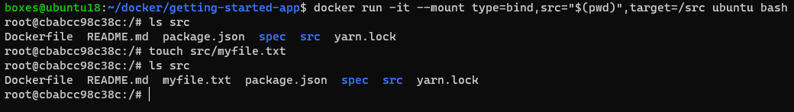

# Latihan Docker
## 1. Menginstal Docker
Jalankan file instaler Docker yang sudah diunduh. Centang opsi *Add shortcut to desktop*.  
  
  
Proses *unpacking files* berlangsung. Tunggu hingga selesai.   
  
  
Instalasi telah selesai.  
  
  
Jalankan Docker Desktop kemudian lanjutkan dengan *Sign in* apabila sudah memiliki akun docker atau pilih *Continue without signing in* jika belum.  
  
  
## 2. Get Started
### 2.1 Containerize an application
Cloning repositori *getting-started-app*.  
```
$ git clone https://github.com/docker/getting-started-app.git$ git clone 
```
  
Masuk ke dalam direktori `getting-started-app` kemudian buat file `Dockerfile`.  
```
$ cd getting-started-app
$ vim Dockerfile
```
  
  
Build image dengan perintah:  
```
$ docker build -t getting-started .
```
  
  
Jalankan container dengan perintah:  
```
$ docker run -dp 127.0.0.1:3000:3000 getting-started
```
  
Buka browser kemudian akses ke halaman 127.0.0.1:3000.  
  
  
Cek dengan perintah `docker ps` untuk melihat daftar container yang berjalan.  
  
  
### 2.2 Update the application
Lakukan modifikasi pada file `src/static/js/app.js`.  
```
- <p className="text-center">No items yet! Add one above!</p>
+ <p className="text-center">You have no todo items yet! Add one above!</p>
```
  
Hentikan container yang sedang berjalan.  
```
$ docker stop <ID container atau nama container>
```
  
Kemudian build ulang image dengan perintah:  
```
$ docker build -t getting-started .
```
  
Jalankan container dengan perintah:  
```
$ docker run -dp 127.0.0.1:3000:3000 getting-started
```
  
  
Refresh halaman `127.0.0.1:3000`.  
  
  
### 2.3 Share the application
Login ke [Docker Hub](https://hub.docker.com/), kemudian buat repositori baru dengan menekan tombol *__Create repository__*.  
  
Pada bagian *Repository Name* diisi dengan `getting-started` dan pastikan *Visibility*-nya `Public`, kemudian klik tombol *__Create__*.  
  
  
Login ke docker hub melalui terminal dengan perintah berikut:  
```
$ docker login -u <username>
```
  
  
Buat *tag* untuk image `getting-started` dengan perintah:  
```
$ docker tag getting-started <username>/getting-started
```
  
  
Push image yang sudah diberi tag tadi ke docker hub dengan perintah:  
```
$ docker push <username>/getting-started
```
  
  
  
Akses situs [Play with Docker](https://labs.play-with-docker.com/), kemudian login dengan akun docker yang digunakan.  
  
Klik tombol *__ADD NEW INSTANCE__*, kemudian jalankan container dari image yang sudah di-*push* ke docker hub tadi.  
```
$ docker run -dp 0.0.0.0:3000:3000 <username>/getting-started
```
  
  
Klik nomor port *__3000__* untuk mengakses halaman web.  
  
  
### 2.4 Persist the DB
Buat sebuah *volume* dengan perintah:  
```
$ docker volume create <nama-volume>
```
  
  
Hapus container sebelumnya dengan perintah `docker rm -f <id>`  
  
  
Jalankan kembali container dari image `getting-started` dengan menambahkan parameter `--mount`:  
```
$ docker run -dp 127.0.0.1:3000:3000 --mount type=volume,src=todo-db,target=/etc/todos getting-started
```
  
  
Akses Todo App melalui browser kemudian tambahkan beberapa data.  
  
  
Hentikan dan hapus container yang sedang berjalan.  
  
  
Jalankan container baru dengan menambahkan parameter `--mount` seperti pada langkah-langkah sebelumnya.  
  
  
Cek browser kembali dan pastikan data yang sebelumnya sudah pernah diinputkan masih ada.  
  
  
Untuk mengetahui lokasi dimana volume berada, gunakan perintah:  
```
$ docker volume inspect <nama-volume>
```
  
  
### 2.5 Use bind mounts
Jalankan container baru dengan perintah:  
```
$ docker run -it --mount type=bind,src="$(pwd)",target=/src ubuntu bash
```
Perintah di atas akan melakukan *mount* direktori `src` yang ada di dalam container ke direktori yang saat ini sedang aktif pada host.  
  
  
Dari dalam container, masuk ke direktori `src` kemudian cek isi direktorinya. Setelah itu buat sebuah file baru dengan nama `myfile.txt`.  
  
  
Keluar dari container dengan perintah `exit`, kemudian cek direktori yang sedang aktif saat ini apakah terdapat file yang sudah dibuat di dalam container tadi.  
  
  
### 2.6 Multi-container apps
Pada bagian ini akan dijalankan dua buah container dimana container pertama adalah container untuk database server dan container kedua adalah todo app. Agar kedua container tersebut dapat saling terhubung, keduanya harus berada di dalam network yang sama. Docker memiliki kemampuan untuk membuat sebuah network yang nantinya akan digunakan oleh container.  
  
Buat sebuah network dengan perintah:  
```
$ docker network create <nama-network>
```
  
  
Jalankan sebuah container MySQL dan hubungkan container tersebut ke dalam network yang telah dibuat tadi. Berikut perintah lengkapnya:  
```
$ docker run -d \
    --network todo-app --network-alias mysql \
    -v todo-mysql-data:/var/lib/mysql \
    -e MYSQL_ROOT_PASSWORD=secret \
    -e MYSQL_DATABASE=todos \
    mysql:8.0
```
  
  
Akses container MySQL menggunakan perintah `docker exec -it <ID Container> mysql -u root -p` dan gunakan password `secure` untuk login mysql. Kemudian cek isi database menggunakan perintah `SHOW DATABASES;`.  
  
  
Selanjutnya jalankan container untuk todo app. Pastikan sudah berada di dalam direktori `getting-started-app`, lalu ketikkan perintah berikut:  
```
$ docker run -dp 127.0.0.1:3000:3000 \
  -w /app -v "$(pwd):/app" \
  --network todo-app \
  -e MYSQL_HOST=mysql \
  -e MYSQL_USER=root \
  -e MYSQL_PASSWORD=secret \
  -e MYSQL_DB=todos \
  node:18-alpine \
  sh -c "yarn install && yarn run dev"
```
  
  
Kita bisa melihat log dari container todo app menggunakan perintah:  
```
$ docker logs -f <ID Container>
```
  
  
Buka todo app melalui browser kemudian tambahkan beberapa data.  
  
  
Cek pada container MySQL untuk memastikan data yang diinput pada todo app sudah tersimpan ke database.  
```
$ docker exec -it <mysql-container-id> mysql -p todos
```
  
  
### 2.7 Use Docker Compose
Buat file `compose.yaml` di dalam direktori `getting-started-app`. Kemudian tambahkan konfigurasi berikut:  
```
services:
  app:
    image: node:18-alpine
    command: sh -c "yarn install && yarn run dev"
    ports:
      - 127.0.0.1:3000:3000
    working_dir: /app
    volumes:
      - ./:/app
    environment:
      MYSQL_HOST: mysql
      MYSQL_USER: root
      MYSQL_PASSWORD: secret
      MYSQL_DB: todos

  mysql:
    image: mysql:8.0
    volumes:
      - todo-mysql-data:/var/lib/mysql
    environment:
      MYSQL_ROOT_PASSWORD: secret
      MYSQL_DATABASE: todos

volumes:
  todo-mysql-data:
```
`app` dan `mysql` adalah nama container yang akan dibuat.  
  
  
Hapus container yang sebelumnya pernah dibuat.  
  
  
Jalankan *Docker Compose* dengan perintah:  
```
$ docker compose up -d
```
  
  
Buka kembali todo app pada browser (localhost:3000) untuk memastikan jika container sudah berjalan dan saling terhubung.  
  
Selesai.