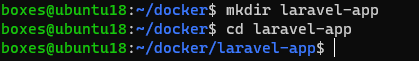
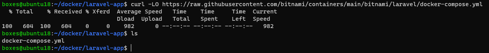
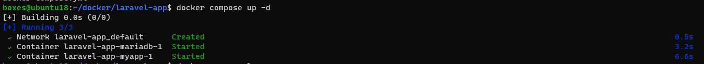
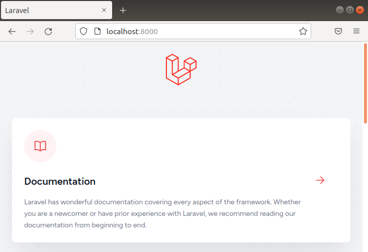
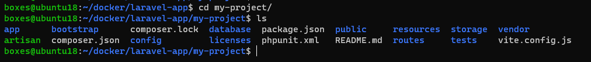
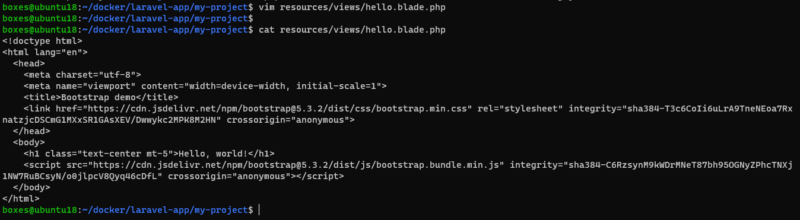
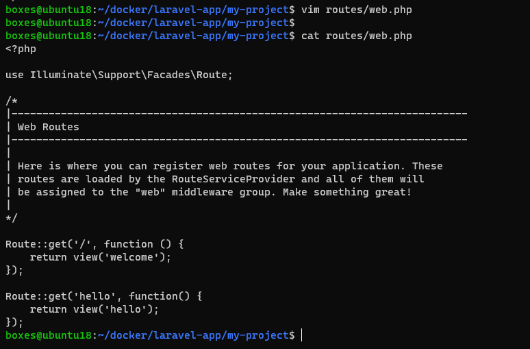
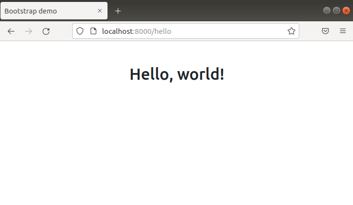

# Laravel Docker Image
## Cara Instal
Buat sebuah direktori dengan nama `laravel-app` kemudian masuk ke dalam direktori tersebut.  
```
$ mkdir laravel-app
$ cd laravel-app
```
  
  
Unduh file `docker-compose.yml` menggunakan perintah:  
```
$ curl -LO https://raw.githubusercontent.com/bitnami/containers/main/bitnami/laravel/docker-compose.yml
```
  
  
Jalankan docker compose dengan perintah `docker compose up -d`.  
  
  
Buka browser dan akses localhost:8000, maka akan tampil halaman dari aplikasi laravel.  
  
  
## Melakukan Development
Untuk mengedit *source code* dari aplikasi laravel, masuk ke dalam direktori `my-project`. Di dalamnya terdapat struktur folder dari aplikasi laravel.  
  
  
Buat sebuah *view* baru di dalam direktori `resources/views/` dengan nama `hello.blade.php`. Kemudian tambahkan kode di bawah ini:  
```
<!doctype html>
<html lang="en">
  <head>
    <meta charset="utf-8">
    <meta name="viewport" content="width=device-width, initial-scale=1">
    <title>Bootstrap demo</title>
    <link href="https://cdn.jsdelivr.net/npm/bootstrap@5.3.2/dist/css/bootstrap.min.css" rel="stylesheet" integrity="sha384-T3c6CoIi6uLrA9TneNEoa7RxnatzjcDSCmG1MXxSR1GAsXEV/Dwwykc2MPK8M2HN" crossorigin="anonymous">
  </head>
  <body>
    <h1 class="text-center mt-5">Hello, world!</h1>
    <script src="https://cdn.jsdelivr.net/npm/bootstrap@5.3.2/dist/js/bootstrap.bundle.min.js" integrity="sha384-C6RzsynM9kWDrMNeT87bh95OGNyZPhcTNXj1NW7RuBCsyN/o0jlpcV8Qyq46cDfL" crossorigin="anonymous"></script>
  </body>
</html>
```
  
  
Kemudian tambahkan sebuah *route* baru di dalam file `routes/web.php`:  
```
Route::get('hello', function() {
    return view('hello');
});
```
  
  
Buka browser, kemudian akses ke localhost:8000/hello.  
  
  
Selesai.