# Getting Started - Docker Compose
*Docker Compose* merupakan sebuah *tool* untuk mendefinisikan dan menjalankan aplikasi Docker multi-kontainer. Docker Compose menggunakan file YAML untuk konfigurasinya.  
  
## Step 1: Define the application dependencies
Buat sebuah folder dengan nama `composetest`.  
```
$ mkdir composetest
$ cd composetest
```
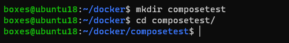  
   
Buat sebuah file dengan nama `app.py`. Kemudian salin kode di bawah ini:  
```
import time

import redis
from flask import Flask

app = Flask(__name__)
cache = redis.Redis(host='redis', port=6379)

def get_hit_count():
    retries = 5
    while True:
        try:
            return cache.incr('hits')
        except redis.exceptions.ConnectionError as exc:
            if retries == 0:
                raise exc
            retries -= 1
            time.sleep(0.5)

@app.route('/')
def hello():
    count = get_hit_count()
    return 'Hello World! I have been seen {} times.\n'.format(count)
```
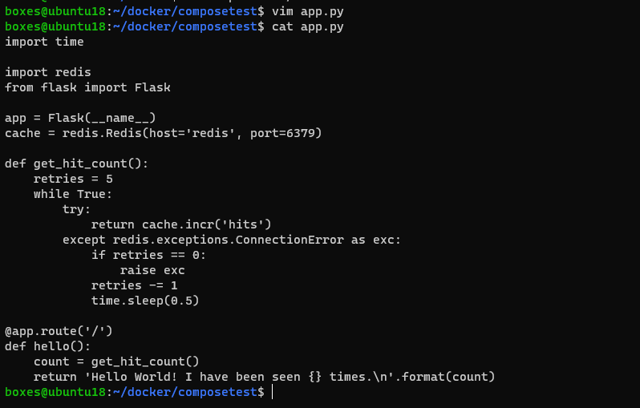  
  
Selanjutnya buat sebuah file dengan nama `requirements.txt`, lalu tambahkan kode berikut:  
```
flask
redis
```
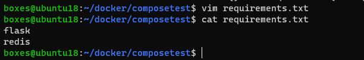  
  
## Step 2: Create a Dockerfile
Buat file dengan nama `Dockerfile` kemudian isi dengan kode berikut:  
```
# syntax=docker/dockerfile:1
FROM python:3.7-alpine
WORKDIR /code
ENV FLASK_APP=app.py
ENV FLASK_RUN_HOST=0.0.0.0
RUN apk add --no-cache gcc musl-dev linux-headers
COPY requirements.txt requirements.txt
RUN pip install -r requirements.txt
EXPOSE 5000
COPY . .
CMD ["flask", "run"]
```
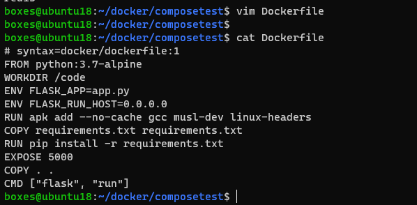  
  
## Step 3: Define services in a Compose file
Buat file dengan nama `compose.yaml` kemudian isi dengan kode berikut:  
```
services:
  web:
    build: .
    ports:
      - "8000:5000"
  redis:
    image: "redis:alpine"
```
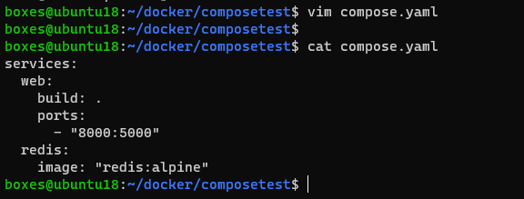  
  
## Step 4: Build and run your app with Compose
Masih di dalam direktorii `composetest`, jalankan aplikasi dengan perintah:  
```
$ docker compose up -d
```
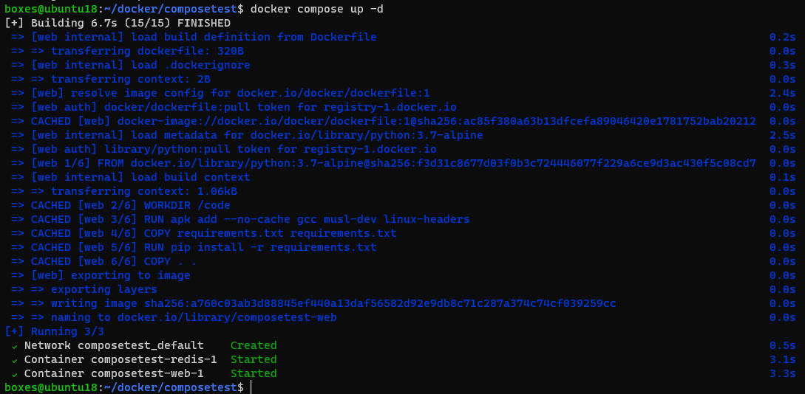  
  
Buka browser dan akses ke alamat `http://localhost:8000`.  
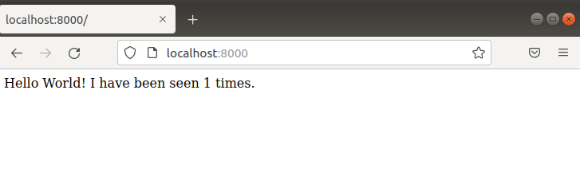  
  
Refresh halaman web dan counter akan bertambah.  
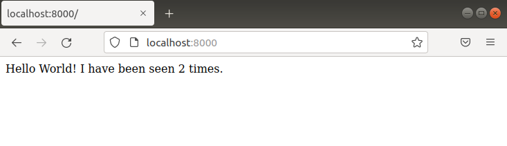  
  
Hentikan aplikasi dengan menggunakan perintah `docker compose down`.  
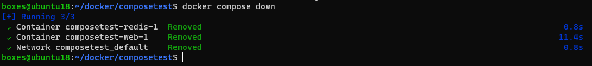  
  
## Step 5: Edit the Compose file to add a bind mount
Edit file `compose.yaml` dan tambahkan *bind mount* pada bagian services web:  
```
services:
  web:
    build: .
    ports:
      - "8000:5000"
    volumes:
      - .:/code
    environment:
      FLASK_DEBUG: "true"
  redis:
    image: "redis:alpine"
```
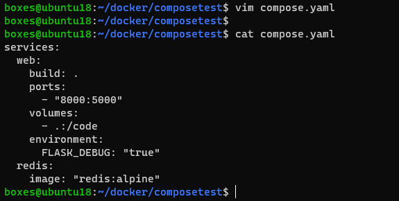  
  
## Step 6: Rebuild and run the app with Compose
Jalankan kembali aplikasi dengan perintah `docker compose up -d`.  
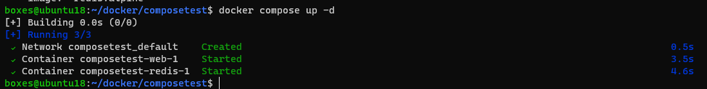  
  
Buka kembali browser dan akses halaman localhost:8000. Maka akan tampil nilai counter seperti pada aplikasi sebelumnya.  
  
## Step 7: Update the application
Edit file `app.py`, ganti bagian `Hello World!` menjadi `Hello from Docker!`.  
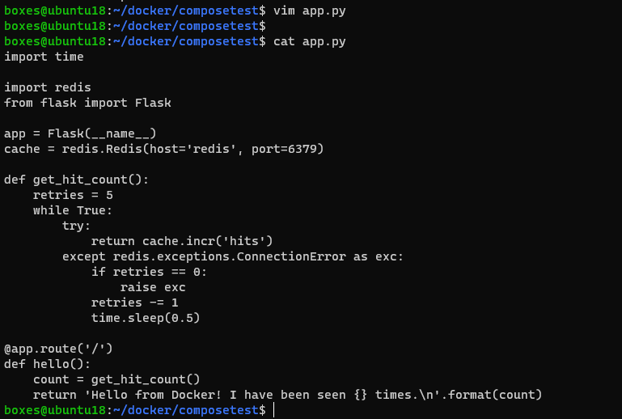  
  
Refresh halaman web dan tulisan *Hello world!* kini berubah menjadi *Hello from Docker!*.  
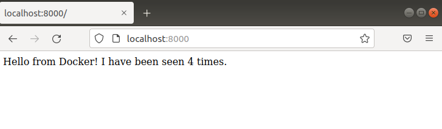  
  
Hentikan aplikasi dengan perintah `dokcer compose stop`, kemudian hapus container beserta data volumenya dengan perintah `docker compose down --volumes`.  
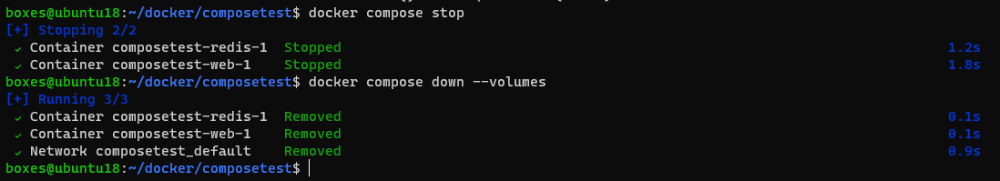  
  
Selesai.