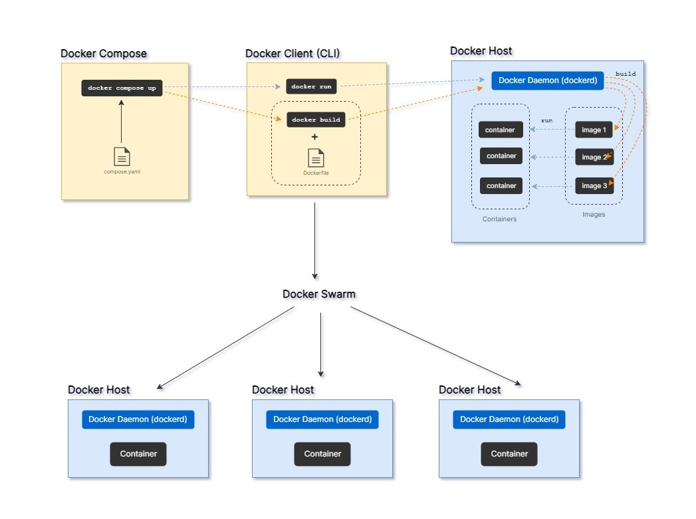

  
  
- *__Docker Daemon (dockerd)__* merupakan sebuah service yang berjalan di latar belakang. Service ini bertugas untuk melakukan manajemen container, network, storage, serta menjalankan perintah-perintah Docker. Docker Daemon berada di dalam sebuah Docker host yakni sebuah host atau komputer yang menjalankan service docker.
- *__Docker Client__* merupakan sebuah interface yang menjembatani user sehingga dapat berinteraksi dengan *Docker Daemon* melalui perintah-perintah Docker. Docker Client dapat berupa *command line terminal* atau melalui *Docker Desktop*.  
- *__Image__* adalah sebuah template *read-only* yang digunakan untuk membuat dan menjalankan suatu container. Image berisi kode-kode, library, dependency, environment variable, serta konfigurasi yang diperlukan untuk membuat sebuah container. Image dapat didefinisikan menggunakan sebuah file bernama Dockerfile.
- *__Container__* adalah sebuah aplikasi yang dibuat dari suatu image dan berjalan dalam lingkungan yang terisolasi, sehingga antara container satu dengan container lain tidak bisa berkomunikasi.  
- *__Docker Compose__* merupakan sebuah tool untuk menjalankan aplikasi multi-container. Docker Compose menggunakan file YAML untuk konfigurasinya. Di dalam file tersebut dapat didefinisikan image, jaringan, volume, dan parameter-parameter lainnya yang akan digunakan oleh container, dan dapat mengkonfigurasi beberapa container sekaligus dalam satu file YAML.  
- *__Docker Swarm__* merupakan *orchestration tool* untuk melakukan manajemen banyak container yang terdapat di beberapa node atau docker host sekaligus.  