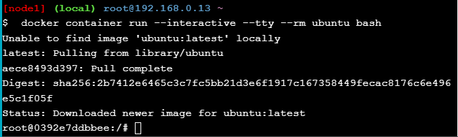

# Praktikum Teknologi Cloud Minggu ke-9
## Docker For Beginners - Linux
### Task 0: Prerequisites
Clone repositori yang akan digunakan untuk latihan dengan perintah:  
```
$ git clone https://github.com/dockersamples/linux_tweet_app
```
  
  
### Task 1: Run some simple Docker containers
Terdapat beberapa cara untuk menjalankan container.  
Cara pertama yakni menjalankan *single task* pada container. Jalankan perintah di bawah ini:  
```
$ docker container run alpine hostname
```
Perintah di atas akan menjalankan sebuah container dari image yang bernama `alpine `dan kemudian memerintahkan container tersebut untuk mengeksekusi perintah `hostname`.  
  
Pada gambar di atas, `e373611bf0e5` merupakan hostname dari container yang juga merupakan ID container.  
  
Cara kedua adalah menjalankan container secara interaktif. Jalankan perintah di bawah ini:  
```
$ docker container run --interactive --tty --rm ubuntu bash
```
Perintah di atas akan menjalankan container dan mengeksekusi perintah *bash* yang kemudian akan menampilkan shell terminal.  
  
  
Di dalam shell kita dapat mengeksekusi perintah-perintah linux seperti `ls`, `ps`, dan `cat`.  
  
  
Cara ketiga adalah menjalankan container pada background. Container akan tetap berjalan selama kita belum melakukan perintah untuk stop atau menghapus containernya. Jalankan perintah di bawah ini:  
```
$ docker container run \
 --detach \
 --name mydb \
 -e MYSQL_ROOT_PASSWORD=my-secret-pw \
 mysql:latest
```
Parameter `--detach` pada kode di atas memerintahkan container agar tetap berjalan pada background setelah container selesai dibuat.  
  
  
Untuk menjalankan perintah di dalam container yang sedang berjalan, menggunakan perintah `docker exec`. Jalankan perintah di bawah ini:  
```
$ docker exec -it mydb \
 mysql --user=root --password=$MYSQL_ROOT_PASSWORD --version
```
  
  
### Task 2: Package and run a custom app using Docker
Masuk ke dalam direktori `linux_tweet_app`. Kemudian cek isi file `Dockerfile` dengan perintah *cat*.  
  
  
Buat variabel `DOCKERID` di terminal dengan menggunakan perintah *export*.  
  
  
Jalankan perintah `docker image build` untuk membuat image dari direktori aplikasi saat ini (linux_tweet_app). Gunakan parameter `--tag` untuk memberikan nama image, dimana penamaan image menggunakan ID docker yang sudah disimpan sebelumnya dalam variabel `$DOCKERID`.  
```
$ docker image build --tag $DOCKERID/linux_tweet_app:1.0 .
```
Cek dengan perintah `docker image ls`.  
  
  
Buat container baru menggunakan image yang sudah dibuat sebelumnya.  
```
$ docker container run \
 --detach \
 --publish 80:80 \
 --name linux_tweet_app \
 $DOCKERID/linux_tweet_app:1.0
```
  
  
Berikut adalah tampilan dari aplikasi yang dibuka pada browser.  
  
  
Hapus container dengan perintah:  
```
$ docker container rm --force linux_tweet_app
```
  
### Task 3: Modify a running website
Jalankan kembali container dengan menambahkan parameter `--mount`.  
```
$ docker container run \
 --detach \
 --publish 80:80 \
 --name linux_tweet_app \
 --mount type=bind,source="$(pwd)",target=/usr/share/nginx/html \
 $DOCKERID/linux_tweet_app:1.0
```

Kemudian copy file `index-new.html` dengan nama `index.html`.  
```
$ cp index-new.html index.html
```

Cek halaman web, maka tampilan akan berubah menjadi seperti berikut:  
  
  
Hapus container dengan perintah:  
```
$ docker rm --force linux_tweet_app
```
  
Lalu jalankan container baru dengan perintah yang sama seperti sebelumnya.  
```
$ docker container run \
 --detach \
 --publish 80:80 \
 --name linux_tweet_app \
 $DOCKERID/linux_tweet_app:1.0
```

Cek halaman web, ternyata tampilan halaman web kembali ke tampilan awal sebelum dimodifikasi.  
  
  
Hapus kembali container dengan perintah:  
```
$ docker rm --force linux_tweet_app
```
  
Lakukan update image dengan cara build ulang image menggunakan perintah:  
```
$ docker image build --tag $DOCKERID/linux_tweet_app:2.0 .
```
  
Cek dengan perintah `docker image ls`  
  
  
Jalankan container menggunakan image yang telah diupdate.  
```
$ docker container run \
 --detach \
 --publish 80:80 \
 --name linux_tweet_app \
 $DOCKERID/linux_tweet_app:2.0
```

Jalankan juga container menggunakan image yang belum diupdate.  
```
$ docker container run \
 --detach \
 --publish 8080:80 \
 --name old_linux_tweet_app \
 $DOCKERID/linux_tweet_app:1.0
```

Cek pada web browser.  
  
  

Selanjutnya adalah melakukan push image ke Docker Hub. Login dahulu dengan perintah `docker login`.  
  
  
Push image versi pertama dengan perintah:  
```
$ docker image push $DOCKERID/linux_tweet_app:1.0
```

Kemudian push image versi kedua dengan perintah:  
```
$ docker image push $DOCKERID/linux_tweet_app:2.0
```
  
Cek image pada repository docker hub.  
  
  
Selesai.