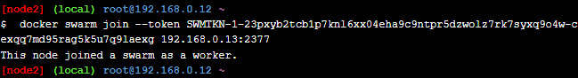

# Praktikum Teknologi Cloud Minggu ke-10
## Docker Networking Hands-on Lab
### Section 1 - Networking Basic
#### Step 1: The Docker Network Command
Salah satu perintah pada Docker khususnya yang berkaitan dengan *networking* adalah `docker network`. Perintah ini memiliki beberapa *command* lanjutan. Untuk melihatnya jalankan perintah `docker network` pada terminal.  
```
$ docker network
```
  
  
#### Step 2: List networks
Seperti image dan container, kita juga dapat melihat daftar atau *list* network yang ada pada Docker Host dengan menggunakan perintah `docker network ls`.  
```
$ docker network ls
```
  
  
#### Step 3: Inspect a network
Kita dapat melihat detail konfigurasi network yang ada di Docker. Misalkan kita ingin melihat konfigurasi dari network dengan nama `bridge` maka perintah yang dijalankan adalah:  
```
$ docker network inspect bridge
```
  
  
#### Step 4: List network driver plugins
```
$ docker info
```
  
  
### Section 2 - Bridge Networking
#### Step 1: The Basics
Docker memiliki *pre-built* network yang bernama `bridge`. Kita dapat melihat daftar network yang ada pada Docker dengan perintah `docker network ls`.  
  
Network bridge pada Docker berfungsi layaknya *Virtual Switch* yang menghubungkan dengan Docker host. Network bridge memiliki interface yang dapat dilihat menggunakan perintah `brctl show`.  
  
Pada gambar di atas, interface `docker0` merupakan interface network bridge pada Docker.  
  
#### Step 2: Connect a container
Jalankan container baru dengan perintah berikut:  
```
docker run -dt ubuntu sleep infinity
```
  
Jalankan kembali perintah `brctl show`.  
  
Terlihat bahwa sekarang bridge `docker0` telah terhubung dengan sebuah interface `vethb261dc6`
  
Jalankan perintah `docker network inspect bridge` untuk melihat konfigurasi networknya.  
  
  
#### Step 3: Test network connectivity
Lakukan ping dari Docker host ke container. Alamat IP container dapat dilihat melalui perintah `docker network inspect bridge`.  
  
  
Masuk ke dalam container dan kemudian jalankan perintah ping ke internet.  
```
$ docker exec -it <ID Container> /bin/bash
# apt-get update && apt-get install -y iputils-ping
# ping -c5 github.com
```
  
  
#### Step 4: Configure NAT for external connectivity
Jalankan container baru menggunakan image NGINX.  
```
$ docker run --name web1 -d -p 8080:80 nginx
```
Perintah `-p 8080:80` akan memetekan port 80 pada container ke port 8080 pada Docker host, sehingga jika kita mengakses `127.0.0.1:8080` maka kita sedang mengakses halaman web yang ada di dalam container.  
  
  
### Section 3 - Overlay Networking
#### Step 1: The Basics
Pada langkah ini akan dilakukan inisialisasi sebuah swarm, join singe worker node, serta verifikasi.  
Jalankan perintah di bawah:  
```
$ docker swarm init --advertise-addr $(hostname -i)
```
  

Kemudian lakukan join pada node ke-2 dengan perintah berikut:  
```
$ docker swarm join --token SWMTKN-1-23pxyb2tcb1p7knl6xx04eha9c9ntpr5dzwolz7rk7syxq9o4w-cexqq7md95rag5k5u7q9laexg 192.168.0.13:2377
```
Perintah di atas didapatkan dari node ke-1 setelah melakukan inisialisasi swarm.
  
  
Cek dengan perintah `docker node ls` pada node ke-1.  
  
  
#### Step 2: Create an overlay network
```
$ docker network create -d overlay overnet
$ docker network ls
```
Perintah di atas dijalankan pada node 1.  
  
  
#### Step 3: Create a service
Buat sebuah service dengan perintah:  
```
$ docker service create --name myservice \
--network overnet \
--replicas 2 \
ubuntu sleep infinity
```
  
  
Cek isi konfigurasi network `overnet` dengan perintah `docker network inspect overnet`.  
  
  
#### Step 4: Test the network
Masuk ke container pada node 2, kemudian ping ke container yang ada pada node 1.  
  
  
#### Step 5: Test service discovery
Masih di dalam container sebelumnya, jalankan perintah berikut:  
```
$ cat /etc/resolv.conf
```
Lakukan ping ke domain `myservice`.  
  

Dari gambar di atas, didapatkan ip address `10.0.1.2` dimana ip tersebut merupakan ip dari service `myservice`. Untuk membuktikannya, cek dengan menjalankan perintah berikut: 
```
$ docker service inspect myservice
```
  
  
### Cleaning Up
Hapus service yang sudah dibuat dengan perintah:
```
$ docker service rm <nama_service>
```
  
  
Keluar dari swarm dengan perintah `docker swarm leave --force` di node1 dan node2.  
  
  
Selesai.