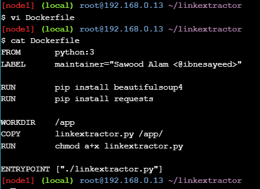

# Praktikum Teknologi Cloud Minggu ke-11
## Application Containerization and Microservice Orchestration
Pada praktikum kali ini akan dipelajari tentang *containerization* menggunakan Docker dan menjalankan berbagai aplikasi secara *microservices*. Beberapa service yang berjalan dalam microservice ini antara lain: 
- Aplikasi web yang ditulis dalam bahasa PHP dan menggunakan server Apache yang akan mengambil URL sebagai masukan dan mengekstrak tautan yang ada di dalamya.
- Server API yang ditulis menggunakan Python (dan Ruby) yang akan memproses ekstraksi tautan dan mengembalikan respons JSON.
- Cache Redis yang digunakan oleh server API untuk menghindari pengambilan berulang dan ekstraksi tautan untuk halaman yang sudah di-*scrap*.

### Stage Setup
Cloning repository.
```
$ git clone https://github.com/ibnesayeed/linkextractor.git
$ cd linkextractor
$ git checkout demo
```
  
  
### Step 0: Basic Link Extractor Script
```
$ git checkout step0
$ tree
```
  
  
Buat sebuah `Dockerfile` kemudian isi dengan script berikut:  
```
FROM       python:3
LABEL      maintainer="Sawood Alam <@ibnesayeed>"

RUN        pip install beautifulsoup4
RUN        pip install requests

WORKDIR    /app
COPY       linkextractor.py /app/
RUN        chmod a+x linkextractor.py

ENTRYPOINT ["./linkextractor.py"]
```
  
  
Build image menggunakan Dockerfile yang sudah dibuat sebelumnya.  
```
$ docker image build -t linkextractor:step1 .
```
  
  
Jalankan sebuah container dari image yang sudah dibuat sebelumnya dan tambahkan perintah `http://example.com` pada saat menjalankan containernya.  
```
$ docker container run -it --rm linkextractor:step1 http://example.com/
```
  
  
Jalankan kembali sebuah container dengan perintah yang sama namun dengan mengubah perintah pada bagian akhir menjadi `https://training.play-with-docker.com/`.  
```
$ docker container run -it --rm linkextractor:step1 https://training.play-with-docker.com/
```
  
  
### Step 2: Link Extractor Module with Full URI and Anchor Text
Checkout ke branch `step2`.  
```
$ git checkout step2
$ tree
```
  
  
Terdapat modifikasi pada file `linkextractor.py`. Untuk melihat isinya gunakan perintah `cat`.  
  
  
Build image baru menggunakan Dockerfile pada direktori saat ini.  
```
$ docker image build -t linkextractor:step2 .
```
  
  
Jalankan sebuah container baru menggunakan image terbaru.  
```
$ docker container run -it --rm linkextractor:step2 https://training.play-with-docker.com/
```
  
  
Jalankan juga sebuah container baru dengan menggunakan image yang lama.  
```
$ docker container run -it --rm linkextractor:step1 https://training.play-with-docker.com/
```
  
  
### Step 3: Link Extractor API Service
Checkout ke branch `step3`.  
```
$ git checkout step3
$ tree
```
  
  
Terdapat penambahan file baru yakni `main.py` dan `requirements.txt`.  
Terdapat perubahan pada file `Dockerfile`. Untuk melihat isinya gunakan perintah `cat`.  
  
  
Gunakan perintah yang sama untuk melihat isi file `main.py`.  
```
$ cat main.py
```
  
  
Build image baru menggunakan Dockerfile saat ini.  
```
$ docker image build -t linkextractor:step3 .
```
  
  
Jalankan sebuah container baru dari image terbaru secara *detach*, menggunakan port `5000:5000`, dan beri nama container dengan `linkextractor`.  
```
$ docker container run -d -p 5000:5000 --name=linkextractor linkextractor:step3
```
  
  
Akses service pada container `linkextractor` dengan melakukan *curl* ke endpoint http://localhost:5000/api/http://example.com/.  
```
$ curl -i http://localhost:5000/api/http://example.com/
```
  
  
### Step 4: Link Extractor API and Web Front End Services
Checkout ke branch `step4`.  
```
$ git checkout step4
$ tree
```
  
Terdapat perubaha struktur direktori dimana saaat ini terdapat dua buah direktori yakni `api` dan `www`. Direktori `api` digunakan untuk menyimpan konfigurasi dan kode untuk service backend, sementara `www` digunakan untuk menyimpan kode file web (user interface). Terdapat juga file `docker-compose.yml` yang berisi konfigurasi untuk membuat service api dan web.  

Lihat isi dari file `docker-compose.yml` menggunakan perintah `cat`.  
  
  
Lihat isi dari file `index.php` dengan menggunanakan perintah `cat`.  
  
  
Jalankan container dengan menggunakan perintah `docker-compose up`.  
```
$ docker-compose up -d --build
```
  
  
Lakukan pengecekan dengan mengakses endpoint http://localhost:5000/api/http://example.com/ menggunakan perintah `curl`.  
```
$ curl -i http://localhost:5000/api/http://example.com/
```
  
  
Lakukan git reset dan `docker compose down`.  
```
$ git reset --hard
$ docker-compose down
```
  
  
### Step 5: Redis Service for Caching
Checkout ke branch `step5`.  
```
$ git checkout step5
$ tree
```
  
  
Terdapat beberapa perubahan antara lain penambahan file `Dockerfile` di dalam direktori `www` serta modifikasi pada file `main.py` dan `docker-compose.yml`.  
  
  
  
  
Jalankan container menggunakan perintah `docker-compose up`.  
```
$ docker-compose up -d --build
```
  
  
Lakukan pengecekan redis menggunakan perintah berikut:  
```
$ docker-compose exec redis redis-cli monitor
```
Pada saat kita melakukan ekstrak halaman web maka akan muncul entry log dari redis.  
  
Lakukan git reset dan `docker-compose down`.  
```
$ git reset --hard
$ docker-compose down
```
  
  
### Step 6: Swap Python API Service with Ruby
Checkout ke branch `step6`.  
```
$ git checkout step6
$ tree
```
  
Terdapat perubahan dimana pada direktori `api`, server yang digunakan sebagai backend menggunakan Ruby.  

Lihat isi file `linkextractor.rb` menggunakan perintah `cat`.  
  
  
Lihat isi file `Dockerfile` dengan menggunakan perintah `cat`.  
  
  
Lihat isi file `docker-compose.yml` dengan menggunakan perintah `cat`.  
  
  
Jalankan container menggunakan perintah `docker-compose up`.  
```
$ docker-compose up -d --build
```
  
  
Lakukan pengecekan dengan mengakses endpoint http://localhost:4567/api/http://example.com/ menggunakan perintah `curl`.  
  
  
Hapus container menggunakan perintah `docker-compose down`.  
  
  
Selesai.