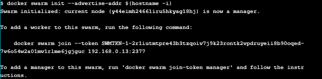
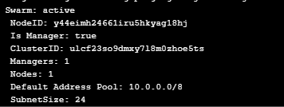
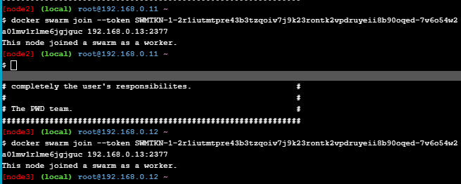
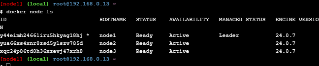
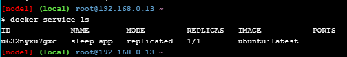
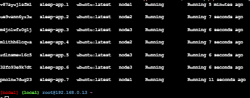
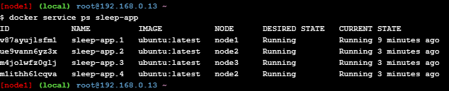
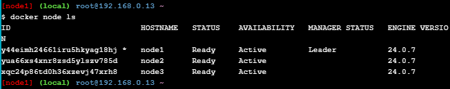
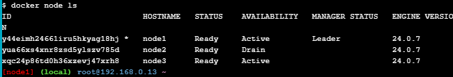
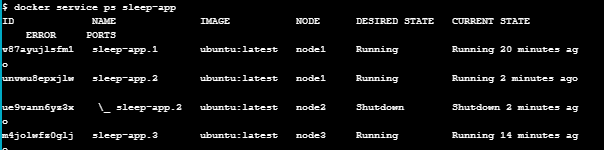

# Praktikum Teknologi Cloud Minggu ke-12
## Docker Orchestration Hands-on Lab
Pada praktikum ini kita akan menggunakan fitur orkestrasi container Docker. Kita akan mengonfigurasi Docker Swarm Mode, dan belajar menerapkan aplikasi sederhana yang sama di beberapa host. Kemudian kita akan melihat cara menskalakan aplikasi dan memindahkan beban kerja ke berbagai host dengan mudah.  
  
### Configure Swarm Mode
#### Create a Manager node
Pada `node1` lakukan inisialisasi Swarm.  
```
$ docker swarm init --advertise-addr $(hostname -i)
```
  
  
Cek apakah `node1` sudah menjadi *node manager* dengan menggunakan perintah `docker info`.  
```
$ docker info
```
  
Terlihat pada bagian *Swarm* bernilai active dan pada bagian *Is Manager* bernilai true.  
  
#### Join Worker nodes to the Swarm
Tambahkan `node2` dan `node3` ke dalam Swarm dengan menggunakan perintah `docker swarm join`. Lihat instruksi pada `node1` ketika melakukan inisialisasi di awal tadi. Berikut contoh perintah join swarm pada praktikum ini:  
```
$ docker swarm join --token SWMTKN-1-2r1iutmtpre43b3tzqoiv7j9k23rontk2vpdruyeii8b90oqed-7v6o54w2a01mv1rlme6jgjguc 192.168.0.13:2377
```
Jalankan perintah di atas pada `node2` dan `node3`.  
  
  
Cek dengan perintah `docker node ls` untuk melihat daftar node yang berada di dalam Swarm.  
  
  
#### Deploy the application components as Docker services
Buat *service* baru dengan nama `sleep-app` pada `node1`. Lalu cek dengan perintah `docker service ls`.
```
$ docker service create --name sleep-app ubuntu sleep infinity
$ docker service ls
```
  
  
#### Scale the application
Lakukan *scale up* sebanyak 7 kali dengan menggunakan perintah berikut:  
```
$ docker service update --replicas 7 sleep-app
```
Kemudian cek dengan perintah `docker service ps sleep-app`.  
  
  
Selanjutnya lakukan *scale down* dengan mengubah replikasi menjadi 4 kali.  
```
$ docker service update --replicas 4 sleep-app
```
Cek kembali dengan perintah `docker service ps sleep-app`.  
 
  
#### Drain a node and reschedule the containers
Misalkan kita ingin melakukan maintenance pada salah satu node (node2). Maka kita perlu mengeluarkan node tersebut (drain) dari Swarm. Perintah yang digunakan adalah:  
```
$ docker node update --availability drain <node ID>
```
`node ID` dapat dilihat dengan menggunakan perintah `docker node ls`.  
  
Pada gambar di atas, `node2` memiliki node id yaitu `yua66xs4xnr8zsd5ylszv785d`. Maka perintah untuk drain `node2` yaitu:  
```
$ docker node update --availability drain yua66xs4xnr8zsd5ylszv785d
```
  
Terlihat bahwa `node2` pada bagian *AVAILABILITY* berubah menjadi *drain*.  
  
Selanjutnya jalankan perintah `docker service ps sleep-app`.  
  
Terlihat bahwa container yang berjalan pada `node2` berubah status menjadi *shutdown*.  
  
#### Cleaning Up
Hapus service `sleep-app` yang telah dibuat tadi.  
```
$ docker service rm sleep-app
```
  
Kemudian hapus `node1`, `node2`, dan `node3` dari Swarm. Jalankan perintah berikut di semua node:  
```
$ docker swarm leave --force
```
  
Selesai.