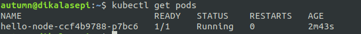

# Praktikum Teknologi Cloud Minggu ke-13
## Hello Minikube
Praktikum ini membahas mengenai cara menjalankan aplikasi di Kubernetes menggunakan minikube.  
  
### Create a minikube cluster
Jalankan minikube dengan perintah:  
```
$ minikube start
```
  
  
Buka dasbor kubernetes dengan perintah berikut:  
```
$ minikube dashboard --url
```
  
  
  
Buat sebuah *Deployment* untuk memanajemen *Pod* dengan menggunakan perintah berikut:  
```
$ kubectl create deployment hello-node --image=registry.k8s.io/e2e-test-images/agnhost:2.39 -- /agnhost netexec --http-port=8080
```
  
  
Jalankan perintah `kubectl get deployments` untuk melihat *Deployment* yang sudah dibuat.  
  
  
Jalankan perintah `kubectl get pods` untuk melihat daftar *Pod* yang berjalan. 
   
  
Jalankan perintah `kubectl get events` untuk melihat *cluster events*.  
  
  
Jalankan perintah `kubectl config view` untuk melihat konfigurasi.  
  
  
Jalnakan perintah `kubectl logs hello-node-ccf4b9788-p7bc6` untuk melihat log dari aplikasi yang sedang berjalan.  
  
  
### Create a Service
Ekspos *Pod* ke publik dengan menggunakan perintah berikut:  
```
$ kubectl expose deployment hello-node --type=LoadBalancer --port=808
```
Perintah di atas akan membuat sebuah *Service* yang bertujuan untuk membuat aplikasi dapat diakses dari jaringan luar.  
  

Jalankan perintah `kubectl get services` untuk melihat *Service* yang sudah dibuat.  
  
  
Jalankan perintah berikut:  
```
$ sudo minikube service hello-node
```
Perintah di atas akan menampilkan respon dari aplikasi yang sedang dijalankan tadi.  
  
  
  
### Enable addons
Jalankan perintah `minikube addons list` untuk melihat daftar addons yang tersedia.  
  
  
Aktifkan sebuah addons, contohnya `metrics-server` dengan menggunakan perintah berikut:  
```
$ minikube addons enable metrics-server
```

Jalankan perintah berikut:  
```
$ kubectl get pod,svc -n kube-system
```
  

Nonaktifkan addons `metrics-server` dengan perintah:  
```
$ minikube addons disable metrics-server
```
  
### Cleaning up
Hapus *Deployment* dan *Service* yang sudah dibuat sebelumnya.  
```
$ kubectl delete service hello-node
$ kubectl delete deployment hello-node
```
  
  
Hentikan minikube dengan perintah:  
```
$ minikube stop
```  
  
  
Apabila sudah tidak ingin menggunakan minikube lagi, dapat dilakukan penghapusan dengan perintah:  
```
$ minikube delete
```
  
Selesai.